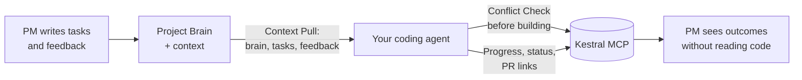

# Kestral Sync

Keep your coding agent and [Kestral](https://app.kestral.ai) in sync — automatically. Your agent reads Kestral before
building (no duplicate or conflicting work), writes plain-language progress as you code, and links PRs to tasks when you
push.

- **Before you build:** the agent checks who's working on what, pulls the project brain and customer feedback, and warns
  you about conflicts or overlapping work.
- **While you work:** plain-language progress comments land on the task so PMs see outcomes without reading code.
- **When you push:** meaningful progress and PR links land on the branch-linked task in one call. If the branch is not
  registered yet, an existing PR link can identify the task; if neither is linked, the agent asks before creating one.

## The loop



## Install

Sync is **ambient-first** when hooks are enabled, but only in folders that have opted in:

| Local state                               | What hooks do                                                                                                                        |
| ----------------------------------------- | ------------------------------------------------------------------------------------------------------------------------------------ |
| `~/.kestral/hook-repos.json` → `"linked"` | Session start → `session_start`; push/PR → `sync_after_push`                                                                         |
| Home prefs `"skip"`                       | Stay quiet                                                                                                                           |
| Neither                                   | Session start runs light `repo_opt_in`: connected GitHub remotes auto-enable; others get a one-time off-by-default notice + `"skip"` |

Hooks are **optional** — setup explains why and asks before enabling (default yes). Skills and the Kestral connection
still work if you decline; sync when you ask, or re-enable later with `bash setup.sh --hooks-only`.

The explicit `/kestral:sync` (or `$kestral-sync`) invocation is a manual "sync now" escape hatch. After a successful
sync in a folder, upsert `"linked"` in `~/.kestral/hook-repos.json` so future sessions use ambient sync — and say so in
one line. Say “enable/disable Kestral auto-sync for this repo” anytime to override.

**Recommended one-shot install** (Claude Code, Cowork, Codex, and/or Cursor):

```bash
curl -fsSL https://raw.githubusercontent.com/Kestral-Team/kestral-plugins/main/setup.sh | bash
```

Flags: `--with-hooks` / `--no-hooks` / `--hooks-only` / `--app claude-code|codex|cursor`. See the
[plugin README](../../README.md).

### Claude Code / Claude Cowork

1. Install via `setup.sh` or:

   ```bash
   claude plugin marketplace add Kestral-Team/kestral-plugins
   claude plugin install kestral@kestral-plugins
   ```

2. **Hooks (if enabled):** session-start and post-push reminders. Reload plugins or restart Claude Code after
   install/update. Installing the plugin is the trust step; Claude Code does not require separate per-hook approval.

3. **Ambient sync (optional backup):** paste [`rules/agents-snippet.md`](rules/agents-snippet.md) into your project's
   `AGENTS.md` or `CLAUDE.md` if you want the same triggers in project docs.

4. **Manual sync:** run `/kestral:sync` whenever you want an immediate sync.

### Codex

1. Install via `setup.sh` or **Plugins > More > Add more** with repo `Kestral-Team/kestral-plugins`.

2. **Authenticate** — **App:** open **Plugins → Kestral**, click the **MCP servers** gear icon, find **Kestral** under
   **From plugins**, and click **Authenticate**. **CLI:** run `codex mcp login Kestral`. Then start a new thread using
   `/new` — the thread where you logged in will not see Kestral tools.

3. **Activate hooks (required if enabled):** start a new Codex CLI session, open `/hooks`, then review and trust the
   Kestral hooks. Codex skips them until you do this and may ask again after an update changes a hook.

4. **Ambient sync backup:** paste [`rules/agents-snippet.md`](rules/agents-snippet.md) into your project's `AGENTS.md`.

5. **Manual sync:** type `$kestral-sync` or `@kestral` to target the plugin.

### Cursor

**Recommended:**

```bash
curl -fsSL https://raw.githubusercontent.com/Kestral-Team/kestral-plugins/main/setup.sh | bash -s -- --app cursor
```

Fully quit and restart Cursor.

1. **Authenticate** — Settings → **Tools & MCPs** → **Connect** on **Kestral** if prompted.
2. **Hooks (if enabled)** — session-start / post-push reminders load with the plugin.
3. **Manual sync** — ask the agent to sync with Kestral, or invoke the `kestral-sync` skill.

**Team admins:** add marketplace `Kestral-Team/kestral-plugins` at [cursor.com/dashboard](https://cursor.com/dashboard).

**Advanced fallback (MCP only):** connect MCP manually, then copy the rule and skill into your project:

1. **Connect MCP** — Settings → **Tools & MCPs**, or add:

   ```json
   {
     "mcpServers": {
       "Kestral": { "url": "https://app.kestral.ai/mcp" }
     }
   }
   ```

2. **Ambient sync:** use `setup.sh --app cursor` (or `--hooks-only`) so session-start and post-push hooks are installed.
   Do not rely on a project `.mdc` rule — hooks + the sync skill are enough.
3. **Full skill (optional):** copy [`SKILL.md`](SKILL.md) into `.agents/skills/kestral-sync/SKILL.md`.

### VS Code

1. **Connect MCP** — add to `.vscode/mcp.json` or your MCP settings:

   ```json
   {
     "mcpServers": {
       "Kestral": { "url": "https://app.kestral.ai/mcp" }
     }
   }
   ```

2. **Optional instructions:** paste [`rules/agents-snippet.md`](rules/agents-snippet.md) into your project's `AGENTS.md`
   if your client has no sync hooks.

### Other MCP-compatible clients

Any client that speaks MCP can use sync. Connect to `https://app.kestral.ai/mcp`, enable hooks when available, or paste
[`rules/agents-snippet.md`](rules/agents-snippet.md) into whatever agent instruction file your client reads.

## What it reads and writes

| Direction  | Data                                                    | When                                                    |
| ---------- | ------------------------------------------------------- | ------------------------------------------------------- |
| **Reads**  | Tasks (status, assignee, comments, acceptance criteria) | Every sync — fast lookup chain, conflict check          |
| **Reads**  | Projects and Project Brain                              | Context Pull — before building                          |
| **Reads**  | Customer feedback                                       | Context Pull — surfaces the *why* behind a task         |
| **Reads**  | Workspace members and statuses                          | Resolving names, discovering valid status keys          |
| **Writes** | Task status transitions                                 | Phase complete, PR opened, PR merged                    |
| **Writes** | Plain-language comments                                 | Progress, bugfix, decision, review summary              |
| **Writes** | PR links                                                | On push when a PR exists — atomic with status + comment |
| **Writes** | New tasks                                               | **Only with your approval** — from branch or bugfix     |

Sync never creates tasks without asking. Status and comment writes happen at meaningful transitions, not on every
commit.

## Example session

```
You: I'm working on TASK-42

Agent: [calls entity_lookup with slug "TASK-42"]
       Found: "Improve date range filtering" — assigned to you, status Todo.
       No conflicts. Setting to In Progress.
       [calls execute_operation("claim_task_and_branch", { taskId, branchName: "feat/date-range-filter" })]
       Claimed TASK-42, set to In Progress.

       [calls entity_lookup: project_brain]
       Project context: The filtering overhaul aims to reduce support tickets about
       date confusion. Customer feedback mentions "can't filter by last 7 days" (12 mentions).

       Ready to build.

  ... you code for a while ...

You: push and sync

Agent: [calls execute_operation("sync_after_push", { branchName: "feat/date-range-filter", prUrl, summary:
        "Users can now filter by date range — last 7/30/90 days plus custom." })]
       Synced TASK-42:
         PR: github.com/org/repo/pull/347 linked
         Comment posted.
```

## Customizing

- **Triggers:** edit the rule/snippet to add or remove sync triggers (e.g. skip review summaries, add sync on deploy).
- **Comment style:** the skill enforces plain-language outcomes by default. Override in the rule if your team prefers
  technical detail.
- **Statuses:** sync discovers your workspace's status keys via `list_statuses` — custom statuses work automatically.
- **Complex operations:** for bulk updates, subtask hierarchy, tag management, or task prioritization, the skill routes
  to the `manage_project` operation (AI agent, 10–30s).

## Coming next

Skills we're considering for the plugin — all pure MCP, no host-specific dependencies:

- **acceptance-check** — diff vs. task acceptance criteria before marking done
- **task-pickup** — claim + branch naming + conflict check in one flow
- **pattern-check** — "have we seen this bug before?" across task history
- **decision-capture** — spike/prototype conclusion → decision record on the task
