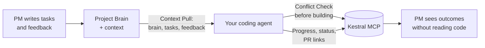

# Kestral Sync

Keep your coding agent and [Kestral](https://app.kestral.ai) in sync — automatically. Your agent reads Kestral before
building (no duplicate or conflicting work), writes plain-language progress as you code, and links PRs to tasks when
you push.

- **Before you build:** the agent checks who's working on what, pulls the project brain and customer feedback, and warns
  you about conflicts or overlapping work.
- **While you work:** plain-language progress comments land on the task so PMs see outcomes without reading code.
- **When you push:** PRs link to tasks, status transitions happen, and the task stays current — all in one call.

## The loop



## Install

Sync is **ambient-first** — the primary install is an always-on rule or snippet that fires automatically on push, PR
creation, and phase completion. The explicit `/kestral:sync` invocation is a manual "sync now" escape hatch.

### Claude Code / Claude Cowork

1. Install the Kestral plugin if you haven't already:

   ```bash
   claude plugin marketplace add Kestral-Team/kestral-plugins
   claude plugin install kestral@kestral-plugins
   ```

2. **Ambient sync:** paste the contents of
   [`rules/agents-snippet.md`](rules/agents-snippet.md) into your project's `AGENTS.md` or `CLAUDE.md`. This gives the
   agent the sync triggers — it will read the full skill automatically when needed.

3. **Manual sync:** run `/kestral:sync` in the chat whenever you want an immediate sync.

### Codex

1. Install the Kestral plugin via **Plugins > More > Add more** with repo `Kestral-Team/kestral-plugins`.

2. **Ambient sync:** paste the contents of [`rules/agents-snippet.md`](rules/agents-snippet.md) into your project's
   `AGENTS.md`. Codex reads this on every task.

3. **Manual sync:** type `$kestral-sync` or `@kestral` to target the plugin.

### Cursor / VS Code

Cursor and VS Code connect to Kestral via MCP (no plugin marketplace). Set up the MCP server first, then copy the skill
and rule into your project:

1. **Connect MCP** — add to your MCP settings (Cursor: Settings > MCP Servers; VS Code: `.vscode/mcp.json`):

   ```json
   {
     "mcpServers": {
       "Kestral": { "url": "https://app.kestral.ai/mcp" }
     }
   }
   ```

   For local file uploads, use the stdio package instead: `{ "command": "npx", "args": ["-y", "@kestral/kestral-mcp"] }`.

2. **Ambient sync (Cursor):** copy [`rules/kestral-sync.mdc`](rules/kestral-sync.mdc) into your project's
   `.cursor/rules/` directory. This always-applied rule gives the agent sync triggers.

3. **Ambient sync (VS Code):** paste the contents of [`rules/agents-snippet.md`](rules/agents-snippet.md) into your
   project's `AGENTS.md`.

4. **Full skill (optional):** copy [`SKILL.md`](SKILL.md) into `.cursor/skills/kestral-sync/SKILL.md` (Cursor) or
   reference it in your agent instructions. The rule/snippet loads the skill automatically when deeper sync logic is
   needed; having a local copy avoids fetching it from the plugin repo.

### Other MCP-compatible clients

Any client that speaks MCP can use sync. Connect to `https://app.kestral.ai/mcp` (or the stdio package for local file
access), then paste the [`rules/agents-snippet.md`](rules/agents-snippet.md) contents into whatever agent instruction
file your client reads.

## What it reads and writes

| Direction | Data | When |
| --------- | ---- | ---- |
| **Reads** | Tasks (status, assignee, comments, acceptance criteria) | Every sync — fast lookup chain, conflict check |
| **Reads** | Projects and Project Brain | Context Pull — before building |
| **Reads** | Customer feedback | Context Pull — surfaces the *why* behind a task |
| **Reads** | Workspace members and statuses | Resolving names, discovering valid status keys |
| **Writes** | Task status transitions | Phase complete, PR opened, PR merged |
| **Writes** | Plain-language comments | Progress, bugfix, decision, review summary |
| **Writes** | PR links | On push when a PR exists — atomic with status + comment |
| **Writes** | New tasks | **Only with your approval** — from branch or bugfix |

Sync never creates tasks without asking. Status and comment writes happen at meaningful transitions, not on every commit.

## Example session

```
You: I'm working on KES-42

Agent: [calls entity_lookup with slug "KES-42"]
       Found: "Improve date range filtering" — assigned to you, status Todo.
       No conflicts. Setting to In Progress.
       [calls update_task: status → in_progress, branchName → feat/date-range-filter]
       Claimed KES-42, set to In Progress.

       [calls entity_lookup: project_brain]
       Project context: The filtering overhaul aims to reduce support tickets about
       date confusion. Customer feedback mentions "can't filter by last 7 days" (12 mentions).

       Ready to build.

  ... you code for a while ...

You: push and sync

Agent: [calls link_pr_to_task with statusKey: "awaiting_review",
        comment: "Users can now filter by date range — last 7/30/90 days plus custom."]
       Synced KES-42:
         Status: In Progress → Awaiting Review
         PR: github.com/org/repo/pull/347 linked
         Comment posted.
```

## Customizing

- **Triggers:** edit the rule/snippet to add or remove sync triggers (e.g. skip review summaries, add sync on deploy).
- **Comment style:** the skill enforces plain-language outcomes by default. Override in the rule if your team prefers
  technical detail.
- **Statuses:** sync discovers your workspace's status keys via `list_statuses` — custom statuses work automatically.
- **Complex operations:** for bulk updates, subtask hierarchy, tag management, or task prioritization, the skill routes
  to the `project_management` tool (AI agent, 10–30s).

## Coming next

Skills we're considering for the plugin — all pure MCP, no host-specific dependencies:

- **acceptance-check** — diff vs. task acceptance criteria before marking done
- **task-pickup** — claim + branch naming + conflict check in one flow
- **pattern-check** — "have we seen this bug before?" across task history
- **decision-capture** — spike/prototype conclusion → decision record on the task
